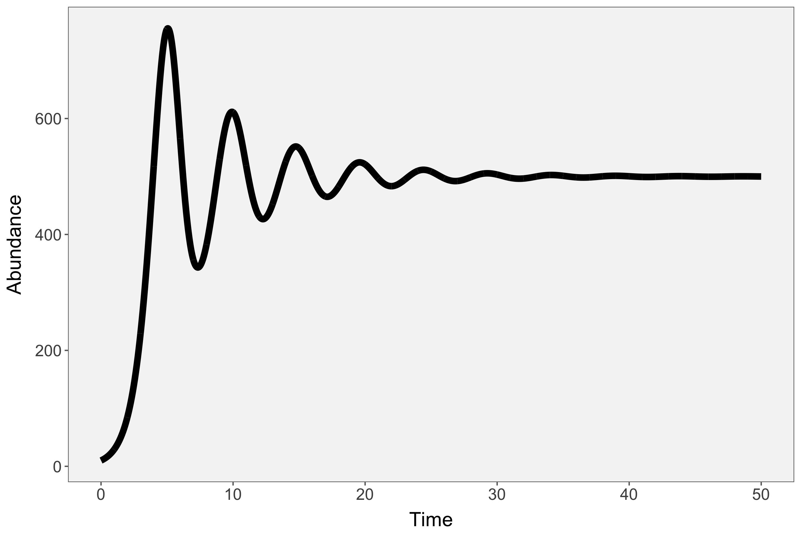
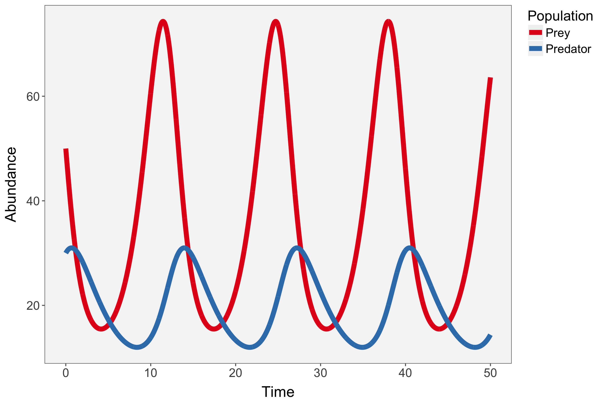
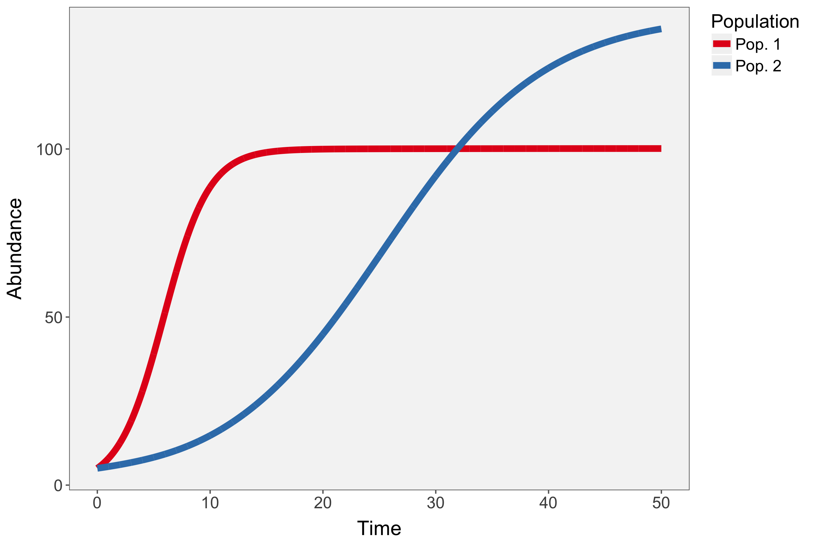
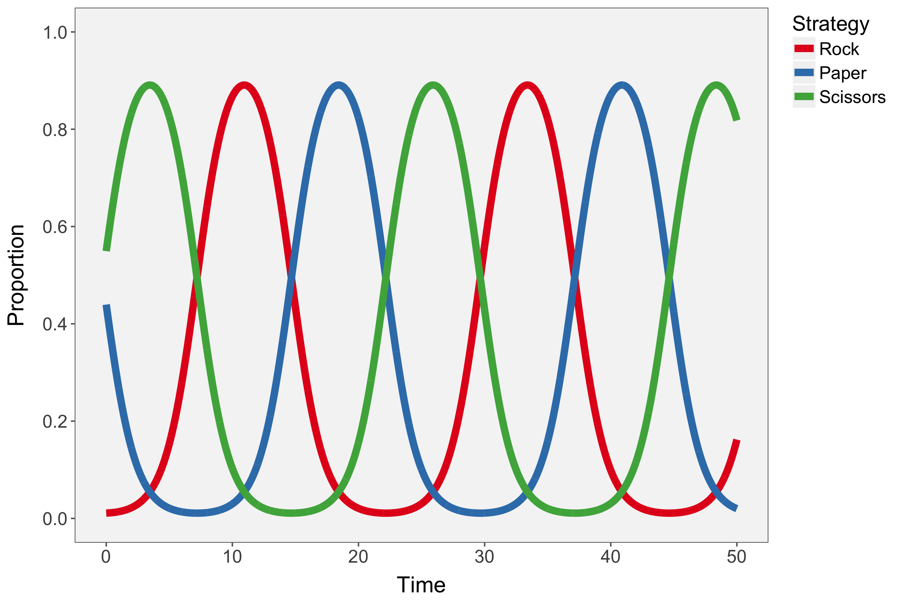
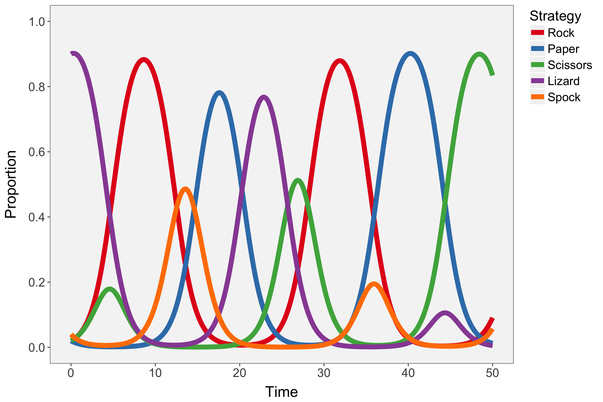
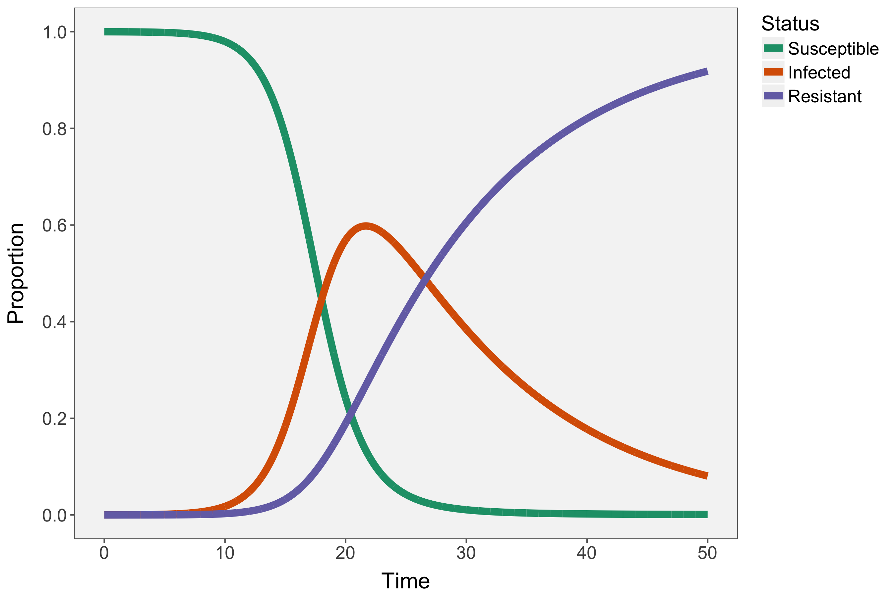

# popmods # 

An R package to obtain tidy numerical results from continuous-time population models in ecology including logistic growth, delayed-logistic growth, Lotka Volterra (predator-prey and competition), rock-paper-scissors intransitive competition, and the SIR epidemiological model.


## Installation

Install the development version from GitHub with:

```R
# install.packages("devtools")
devtools::install_github("patrickbarks/popmods")
```

## Usage

```R
library(popmods)
library(ggplot2)

# vector of time points at which to evaluate models
t <- seq(0, 50, 0.01)
```

#### Delayed logistic
```R
df_dlog <- logistic_delay(time = t, init_n = 10, r = 1.1, k = 500, tau = 1.12)

ggplot(df_dlog, aes(Time, Abundance)) +
  geom_line(lwd = 2.5)
```


&nbsp;

#### Lotka-Volterra predator-prey
```R
df_lvpp <- lotka_volterra(time = t, init_n = 50, init_p = 30, r = 0.8, c = 0.04,
                          a = 0.2, m = 0.3)

ggplot(df_lvpp, aes(Time, Abundance, color = Population)) +
  geom_line(lwd = 2.5) +
  scale_color_brewer(type = 'qual', palette = 6)
```


&nbsp;

#### Lotka-Volterra 2-species competition
```R
df_lvcp <- lotka_volterra_comp(time = t, init_n1 = 5, init_n2 = 5, r1 = 0.5,
                               r2 = 0.1, k1 = 100, k2 = 100, a1 = -0.001,
                               a2 = -0.4)

ggplot(df_lvcp, aes(Time, Abundance, color = Population)) +
  geom_line(lwd = 2.5) +
  scale_color_brewer(type = 'qual', palette = 6)
```


&nbsp;

#### Rock-paper-scissors intransitive competition
```R
df_rps <- rps(time = t, init_r = 0.01, init_p = 0.4, init_s = 0.5, b = 0.8)

ggplot(df_rps, aes(Time, Proportion, color = Strategy)) +
  geom_line(lwd = 2.5) +
  scale_y_continuous(limits = c(0, 1), breaks = seq(0, 1, 0.2)) +
  scale_color_brewer(type = 'qual', palette = 6)
```


&nbsp;

#### Rock-paper-scissors-lizard-spock intransitive competition
```R
df_rpslk <- rpslk(time = t, init_r = 0.02, init_p = 0.02, init_s = 0.02,
                  init_l = 0.9, init_k = 0.04, b = 0.8)

ggplot(df_rpslk, aes(Time, Proportion, color = Strategy)) +
  geom_line(lwd = 2.5) +
  scale_y_continuous(limits = c(0, 1), breaks = seq(0, 1, 0.2)) +
  scale_color_brewer(type = 'qual', palette = 6)
```


&nbsp;

#### SIR epidemiological model
```R
df_sir <- sir(time = t, init_s = 0.9999, init_i = 0.0001, init_r = 0,
              gamma = 0.6, beta = 0.08)

ggplot(df_sir, aes(Time, Proportion, color = Status)) +
  geom_line(lwd = 2.5) +
  scale_y_continuous(limits = c(0, 1), breaks = seq(0, 1, 0.2)) +
  scale_color_brewer(type = 'qual', palette = 2)
```

