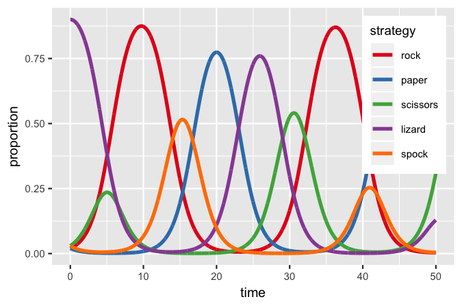
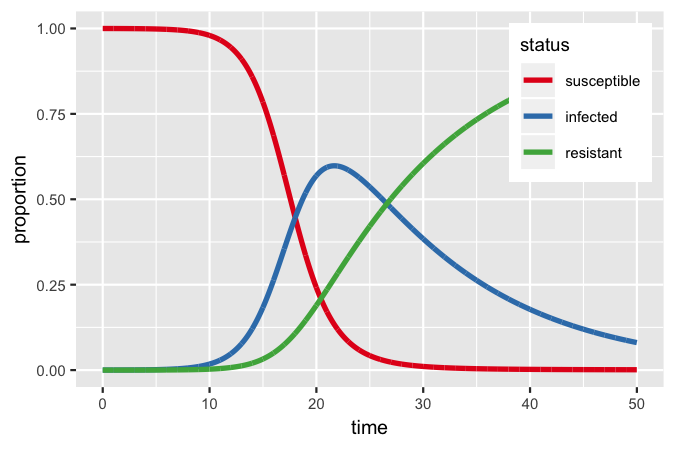

<!-- README.md is generated from README.Rmd. Please edit that file -->
[](https://ci.appveyor.com/project/patrickbarks/popmods) [](https://travis-ci.org/patrickbarks/popmods)

popmods
=======

Easy numerical analysis of continuous-time population models in ecology.

Models currently supported:

-   logistic growth
-   delayed-logistic growth
-   Lotka Volterra (predator-prey)
-   Lotka Volterra (two-species competition)
-   rock-paper-scissors intransitive competition
-   rock-paper-scissors-lizard-spock
-   SIR epidemiological model

Installation
------------

Install the development version from GitHub with:

``` r
devtools::install_github("patrickbarks/popmods")
#
# or
#
install.packages("remotes") # smaller and quicker to install than devtools
remotes::install_github("patrickbarks/popmods")
```

Usage
-----

``` r
library(popmods)
library(ggplot2)

# vector of time points at which to evaluate models
t <- seq(0, 50, 0.01)
```

###### Delayed logistic

``` r
df_dl <- logistic_delay(time = t, init_n = 10, r = 1.1, k = 500, tau = 1.12)

ggplot(df_dl, aes(time, abundance)) +
  geom_line(lwd = 1.2)
```


###### Lotka-Volterra predator-prey

``` r
df_lvpp <- lotka_volterra(time = t, init_n = 50, init_p = 30, r = 0.8, c = 0.04,
                          a = 0.2, m = 0.3)

ggplot(df_lvpp, aes(time, abundance, color = population)) +
  geom_line(lwd = 1.2) +
  scale_color_brewer(type = 'qual', palette = 6)
```


###### Rock-paper-scissors-lizard-spock competition

``` r
df_rpslk <- rpslk(time = t, init_r = 0.02, init_p = 0.02, init_s = 0.03,
                  init_l = 0.9, init_k = 0.03, b = 0.7)

ggplot(df_rpslk, aes(time, proportion, color = strategy)) +
  geom_line(lwd = 1.2) +
  scale_color_brewer(type = 'qual', palette = 6)
```



###### SIR epidemiological model

``` r
df_sir <- sir(time = t, init_s = 0.9999, init_i = 0.0001, init_r = 0,
              gamma = 0.6, beta = 0.08)

ggplot(df_sir, aes(time, proportion, color = status)) +
  geom_line(lwd = 1.2) +
  scale_color_brewer(type = 'qual', palette = 6)
```



Contributions
-------------

All contributions are welcome. Please note that this project is released with a [Contributor Code of Conduct](CONDUCT.md). By participating in this project you agree to abide by its terms.
